# ROS 2 Humble Installation Setup

This repository documents the installation and configuration of ROS 2 Humble on Ubuntu 22.04 LTS using Windows Subsystem for Linux 2 (WSL2).

The report includes the installation steps, configuration process, verification, and problems encountered during the setup.

---

## 1. Introduction

ROS 2 (Robot Operating System 2) is a framework used for developing robotic applications. It provides tools, libraries, and communication mechanisms that help developers build and control robotic systems.

In this setup, ROS 2 Humble was installed on Ubuntu 22.04 LTS through WSL2 on Windows.

### Environment

- Operating System: Windows
- Linux Environment: WSL2
- Ubuntu Version: Ubuntu 22.04.5 LTS
- ROS 2 Distribution: ROS 2 Humble

---

# 2. Installing WSL2 and Ubuntu 22.04

Windows Subsystem for Linux 2 (WSL2) allows running a Linux environment directly on Windows without using a virtual machine.

The installed WSL distributions were checked using PowerShell:

```powershell
wsl -l -v
```

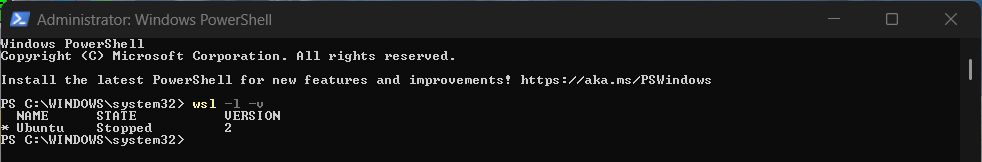

Ubuntu 22.04 was installed using PowerShell as Administrator with the following command:

```powershell
wsl --install -d Ubuntu-22.04
```

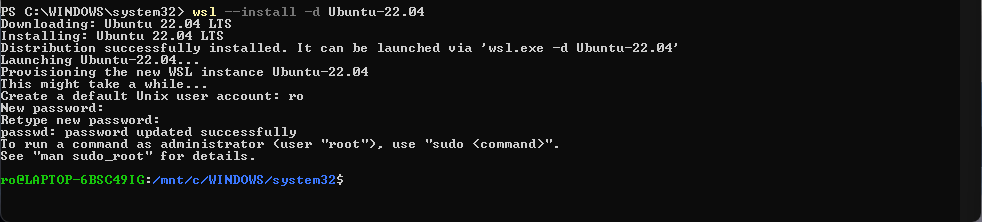

After installation, the system was restarted, and Ubuntu 22.04 was launched through WSL2 to continue the configuration process.

---

# 3. Checking Ubuntu Version

The installed Ubuntu version was verified using:

```bash
lsb_release -a
```
The output confirmed that Ubuntu 22.04.5 LTS was installed.

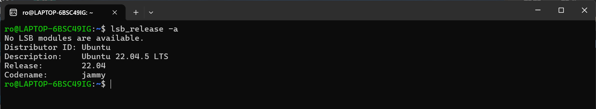

---
## 4. Updating Ubuntu Packages

Before installing ROS 2, the system packages were updated using:

```bash
sudo apt update && sudo apt upgrade
```
This step ensures that the system packages are updated before installing ROS 2 dependencies.

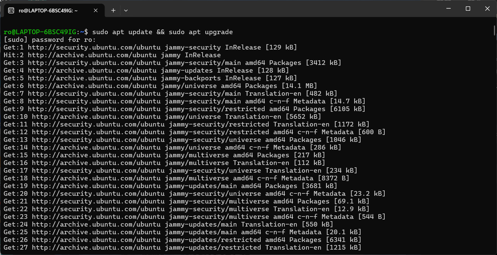

---
## 5. Installing ROS 2 Humble

The required packages were installed first:

```bash
sudo apt install software-properties-common curl
```
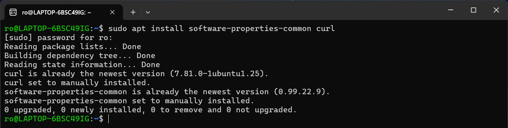

The ROS 2 repository key was added:

```bash
sudo curl -sSL https://raw.githubusercontent.com/ros/rosdistro/master/ros.key -o /usr/share/keyrings/ros-archive-keyring.gpg
```
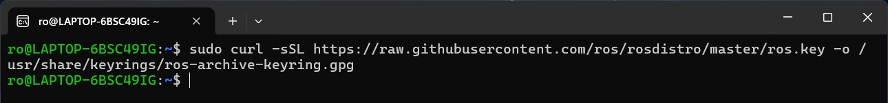

The ROS 2 repository was added:

```bash
echo "deb [arch=amd64 signed-by=/usr/share/keyrings/ros-archive-keyring.gpg] http://packages.ros.org/ros2/ubuntu jammy main" | sudo tee /etc/apt/sources.list.d/ros2.list > /dev/null
```
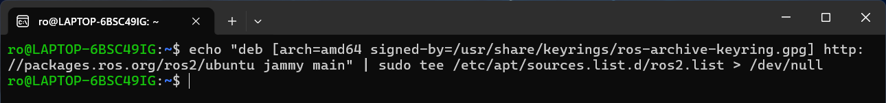

The package list was updated:

```bash
sudo apt update
```

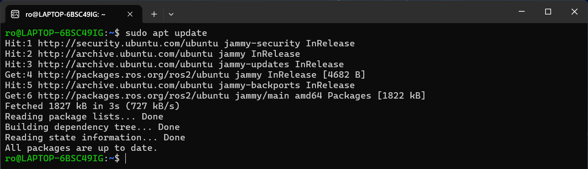

Finally, ROS 2 Humble Desktop was installed:

```bash
sudo apt install ros-humble-desktop
```
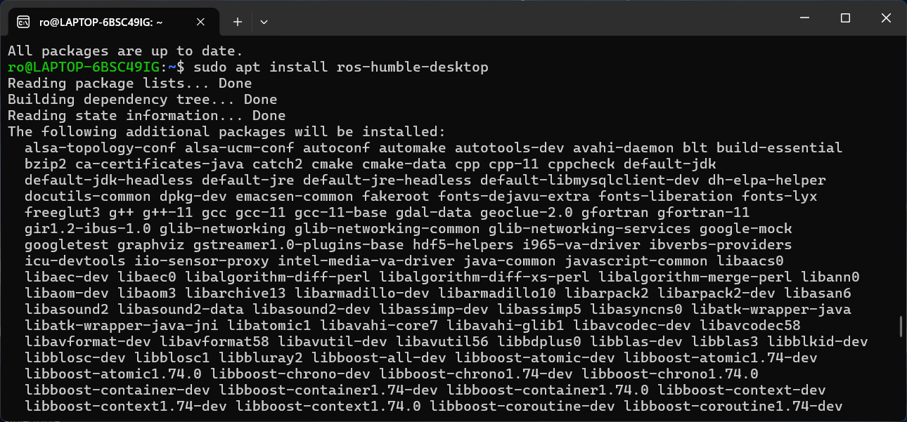

---
## 6. Configuring ROS 2 Environment
To automatically load the ROS 2 environment when opening a new terminal, the following command was used:

```bash
echo "source /opt/ros/humble/setup.bash" >> ~/.bashrc
```
Then, the environment was updated:

```bash
source ~/.bashrc
```
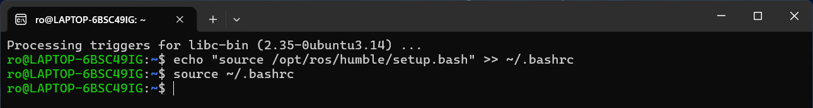

---
## 7. Verifying ROS 2 Installation
The ROS 2 distribution was verified using:

```bash
echo $ROS_DISTRO
```
The output was:

```
humble
```
This confirms that ROS 2 Humble was successfully installed and configured.

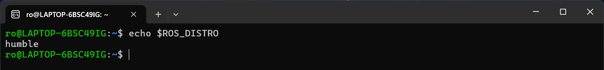

---
## 8. Problems Encountered

### Problem 1: Package Download Failure
During the installation process, some packages failed to download due to a connection timeout.

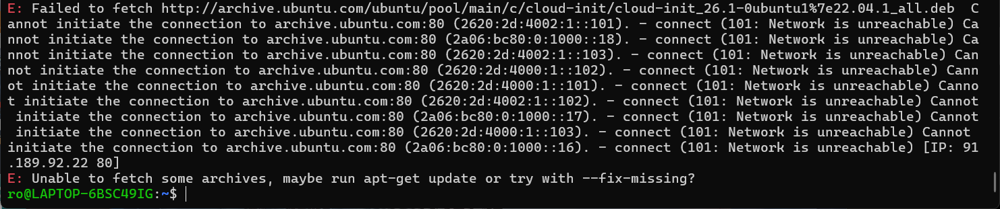

#### Solution
The package list was updated again:

```
sudo apt update
```
After retrying, the installation continued successfully.

---
### Problem 2: ROS 2 Version Command
The command:

```
ros2 --version
```
returned an error because the `ros2` command-line tool does not support the `--version` option.

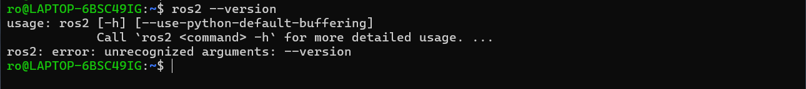

The ROS 2 distribution was checked instead using:

```
echo $ROS_DISTRO
```
The output confirmed:

```
humble
```
---
## Installation Completed

ROS 2 Humble was successfully installed on Ubuntu 22.04.5 LTS using WSL2.

The ROS 2 environment was configured successfully and verified, making the system ready for robotic application development.
